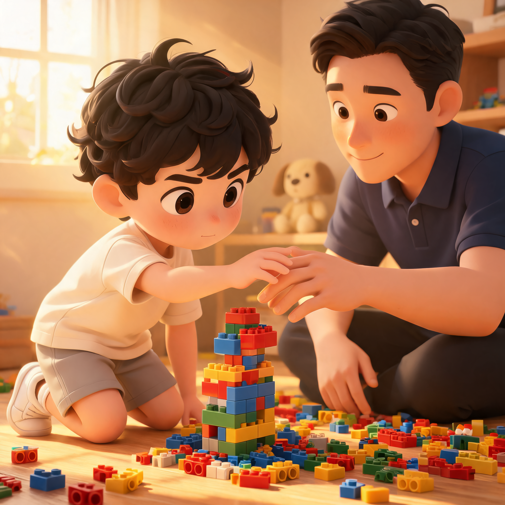

去年秋天的一个下午，产品经理跑过来找我，说线上出了个紧急问题，需要尽快出一个修复方案。

当时我们组新来了一个后端小伙，叫小陈，刚转正两个月。我把他叫过来，简单描述了一下问题，然后习惯性地打开电脑准备画架构图。

画到一半我突然想起来——那天早上刚看完一本管理书，里面有一句话印象很深："你每替下属解决一个问题，就剥夺了一次他成长的机会。"

于是我硬生生把画了一半的图关了。

我跟小陈说："你主导，想一个方案出来。下午三点我们碰一下。"

然后我就去开会了。

***

三点到了，小陈拿着笔记本过来。他画了一个方案，说实话——有很多问题。

他没有考虑到缓存击穿。他把补偿逻辑耦合在业务流程里。他选择的技术方案多引入了一个中间件。

我坐在那里，看着他的方案图，感觉嘴里的每个字都在往外蹦。

"这里应该加布隆过滤器……""补偿逻辑要异步解耦……""这个中间件太重了，用 Redis 的 `pub/sub` 就够了……"

每一个建议都是对的。每一点他都确实没考虑到。

但我忍住了。

我说："方案我看到了。有没有考虑过缓存穿透的情况？"

他愣了一下，然后眼睛突然亮了起来："啊，对，布隆过滤器！"

"还有，补偿逻辑如果失败了呢？会不会影响正常流程？"

他思考了几秒："应该拆出来，异步处理。"

那个下午，我几乎没说什么。我只是问了几个问题。

他最后自己把方案优化到了我原本想给的那个版本——甚至更好，因为他在思考缓存穿透的时候，顺带把热点数据分层也考虑了进来。

修复上线之后，那个小伙子在组会上主动复盘了整个事故，讲得比我自己讲还要清楚。

那一刻我突然意识到一个问题：**如果刚才我抢着把所有答案都说了，会怎样？**

他会点头，会照做，会把代码写完。然后他会觉得："嗯，老板厉害。"但下一次，他还是不会。

这让我回想起自己带团队这三年的很多瞬间。

## 第一年：不会闭嘴

刚做 Tech Lead 的时候，我有个执念——我不能让团队犯错。

* 代码 review 的时候，每一个不规范的地方我都要标出来
* 技术评审会上，每个方案我都要深度参与
* 每天晨会上，每个人的困难我都要给出具体的解决路径

那时候我特别自豪。我觉得自己是一个"负责任"的 Leader。

直到有一天，我老婆跟我说了一句话。

那天晚饭的时候，我抱怨团队成长太慢，什么事都要我操心。她听完之后放下筷子，说：

"你什么都替他们做了，他们还成长什么？"

我把筷子也放下了。

她说的是对的。我老婆是做互联网教培设计的，她们公司有一个很厉害的设计总监。那个人带的团队里，每年都有设计师升到高级，每年都有作品拿奖。

她说那个总监有一个特点：**评审设计稿的时候，她只提问题，不给方案。**"这个颜色你想表达什么？""这个按钮用户第一眼会看到吗？""如果用户是左撇子呢？"

听到问题的人会自己去想答案。自己想了，就记住了。下次不问了。

我那天晚上翻来覆去睡不着。我想起自己 review 过的那些代码，提过的那些建议。我突然觉得自己像一个拿着答案的人，然后期待别人抄完之后能学会解题。

怎么可能呢。

## 第二年：学会闭嘴

后来我开始刻意练习一件事：在技术评审和 code review 里，先问问题，不给答案。

说起来很简单，做起来比戒烟还难。

有一次我们组在讨论一个微服务拆分的方案。两个同事各执一词，一个主张按业务域拆，一个主张按流量特征拆。吵了半个小时，谁也说服不了谁。

两个人同时看向我："老大你觉得呢？"

我张了张嘴，把到嘴边的话咽了回去。

"你们觉得按业务域拆，最大的风险是什么？"

主张按业务域拆的同事想了想："如果某个业务的数据量突然爆炸，其他业务会受影响。"

"那按流量特征拆，最大的风险是什么？"

另一个同事说："同一个业务的理解可能被拆散，排查问题的时候链路会复杂。"

然后我说："有没有第三种可能？"

他俩对视了一眼，沉默了大概三十秒。然后其中一个说："业务域主拆，然后把高频接口独立部署？"

另一个补充："对，可以用网关层的路由策略来动态调整。"

这个方案，就是我心里想说的答案。但我没说。

他们自己想出来的。那天下午，他们自己把方案细化成了一篇 Confluence 文档，第二天就过了技术评审。

后来我发现，"闭嘴"这件事，比我想象的威力要大得多。

**闭嘴，不是不管。是用一种更难的方式在管。**

## 第三年：听懂闭嘴

到了第三年，我对"闭嘴"这件事有了更深的理解。

闭嘴不只是不给答案。闭嘴的本质是：**把空间让给团队**。

打个比方。我儿子 dorian 今年四岁，上中班。他最近迷上了拼乐高。

一开始他拼的时候，我在旁边看着急得不行——颜色不对，结构不稳，少了几个关键零件。我忍不住伸手："爸爸帮你。"

他把我的手推开："我自己来。"

然后他歪歪扭扭地拼出了一个我也不知道是什么东西的造型，举起来跟我说："这是太空船！"

看着那个完全不像是太空船的太空船，我突然觉得比我拼出来的任何一个都好看。

带团队也是一样。

你给的乐高，是我拼的。他拼的乐高，不管多歪，都是他自己的。

这件事在工作里的体现，比你想象的更具体。

比如技术方案的取舍。很多时候不是只有一个正确答案。你心里的那个"最佳方案"，是你基于你自己的经验、你自己的风险偏好、你自己的舒适区做出来的判断。换一个人，同样的约束条件下，可能有完全不同的权衡。

如果你每次都给出"你的最佳方案"，团队就会变成你的复读机。

但如果你闭上嘴，让他们自己权衡，让他们自己承担后果——当然，只要风险可控——他们就会长出自己的判断力。

## 闭嘴不是消失

说了这么多"闭嘴"的好处，我必须要补充一句：**闭嘴不等于消失。**

有一次我矫枉过正了。组里有个同事在做一次线上数据库迁移，方案评审的时候我全程没怎么说话，只是点头。

结果上线那天，差一点就出了事故。迁移脚本有个边界条件没考虑到，幸亏 DBA 在灰度阶段发现了。

那天之后我意识到：闭嘴是有边界的。

* 涉及线上稳定性的事情，不能闭嘴
* 涉及安全合规的事情，不能闭嘴
* 涉及一个实习生完全没接触过的领域，不能闭嘴

所谓的"闭嘴"，不是不管不问。而是**在可以容错的范围内，忍住给答案的冲动，用提问来代替指令。**

判断什么能闭嘴、什么不能闭嘴，这件事本身就考验 Leader 的判断力。

这也是带团队最难的地方——不是管得太多了，就是管得太少了。那个刚刚好的分寸，书上没有标准答案。

## 写在最后

上周五，小陈来找我。

他说他拿到了一个更好的 offer，准备走了。

我有点难过，但也真心替他高兴。他这两年成长确实很快，从一个需要我管住嘴才能成长的新人，变成了一个能独立扛起一整块业务的主力。

临走之前，他跟我说了一句话。

"你最让我感谢的地方是——很多时候你其实早就知道答案了，但你没有直接告诉我们。你让我们自己找。有时候找出来的结果不对，你会问问题，但你还是不说答案。我后来才明白，你是在给我们时间。"

我笑了笑，没有解释。

那一刻我知道，闭嘴这件事，我可能真的学会了。

***

*这就是"心路历程"系列。我不是管理大师，只是一个在技术一线待了十年、带团队三年的普通人。这些文字都是我自己摔过的跟头，走过的弯路。如果你也在经历类似的困惑，希望这些碎碎念能给你一点参考。下周三，我们继续聊。*
