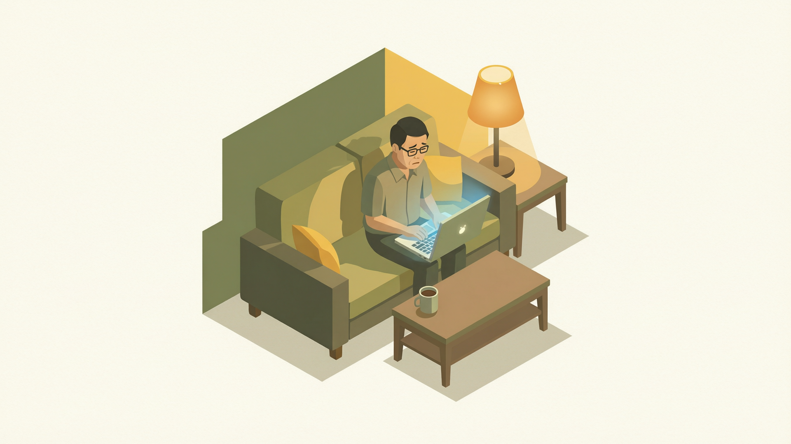
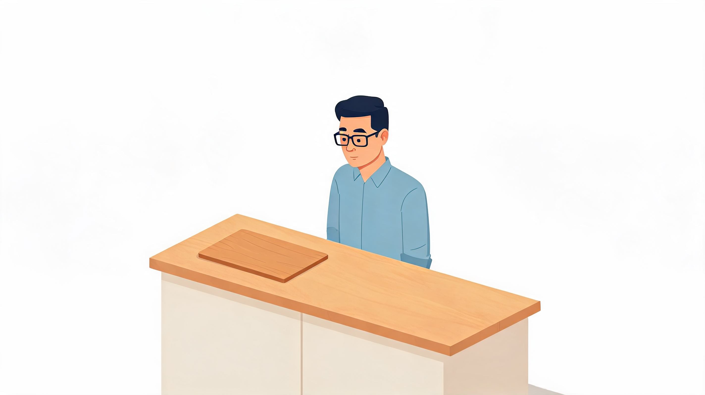

# 本周的 5 个微小感悟（第四期）

> 栏目：心路历程
> 主题：复盘随笔
> 计划发稿：2026-09-19 20:30

这周赶上 dorian 幼儿园开学第二周，家里节奏还没完全调顺。每天晚上八点半把娃哄睡，我也差不多只剩一格电了。坐下来翻翻备忘录，拣出五个一闪而过但没来得及细想的瞬间。

## 感悟一：我发现，"知道但不做"比"不知道"更消耗人

这周有件事挺触动我的。团队里一个年轻同事来做 code review，指着一处设计说："其实我们都知道这里应该重构，但已经拖了三个迭代了。"

这句话像根针扎到我。不是因为他的判断错了，而是他说得太对了——**有些事，你清清楚楚知道该做，但每多拖一天，它就在后台上多占一块认知内存。** 你以为拖着省了时间，实际上它在后台吃你的"心理 CPU"，比真干完更累。

晚上我跟妻子聊这个。她说她们教培行业也一样，明知道课件里某个模块该改了，"但就是不动"。我俩相视苦笑：原来各行各业的人都在背着"知道却还没做"的债。

> 真正让人疲惫的，不是工作量本身，而是那些悬在 to-do list 里"知道该做却没做"的事情。先把它干掉，哪怕只推进一小步，心里那个后台进程就杀掉了。

## 感悟二：儿子教我什么叫"重启"

周二晚上，dorian 因为一块积木找不到哭了十分钟。我试着讲道理——"积木又不会跑，仔细找找就行"——完全没用。

他哭完，自己跑到厨房喝了一口水，回来说："爸爸，我现在重新开始找。"

我愣了。他刚才崩溃成那样，喝完水就像按了重启键，情绪归零了。反观我自己，被老板批一句要闷半天，跟同事争执完回家还在脑子里回放。我一个成年人，重启时间可能是他的一百倍。

> 成年人缺的不是自愈能力，是"喝完一杯水就重新来"的勇气。小孩子的重启键，在喝水、在吃一口点心、在妈妈抱一下；我们的重启键在哪里？

我后来试了一下。周五下午一个跨部门沟通不顺畅，回工位上喝了一大口水，没说什么，重新打开对话框。管用了。

## 感悟三：老婆是家庭里最难被自动化替换的那层"架构"

这周妻子出差两天，我一个人带 dorian。早上六点半起来做早饭、帮他穿衣服、送幼儿园、晚上接回来洗澡讲故事哄睡——全套自己来。

两天下来，只有一个感受：**累到觉得自己像一台没配监控就上线的单点服务。**

我平时总觉得家里的事是"自动运转"的——直到她不在，才发现所有自动化都靠她这个运维在背后撑着。早饭不是冰箱自己变出来的，儿子的衣服不是衣柜自己叠好的，睡前那半小时的亲子共读里藏着她多少精力的投入。这些事，AI 替代不了、SOP 写不出来，全是一种"都在眼里"的家庭判断力。

> 家里的自动化，幕后站着一个人。别把她的付出当"系统自带功能"。

## 感悟四：一个好问题的价值，远超一个漂亮答案

周三带 dorian 散步，他指着一棵树的影子问："爸爸，为什么影子只在太阳有光的那一面不让我看见？"

我脑子里第一个反应是"光照不到所以有影子"——但我没说。他问的不是物理，他是个四岁的孩子，他在用他的语言问：为什么有些东西明明在，却没有出现在另一边？

**好问题的价值不在于它能被准确回答，而在于它撬动了你重新看一件"习以为常"的事。**

这让我反思自己在工作中的习惯——我们太急着给答案了。被问到"这个方案能不能做"时，我说"能"或"不能"；但也许真正有用的回答是："你为什么这样定义'能做'？"

> 成年人的世界里，好问题太稀缺了。因为提一个好问题，要敢于在最熟悉的风景前停下来，说"我不确定我懂"。

## 感悟五：对一件事反复恼怒的时候，可能不是因为别人做错了

这周有个小事。我每次进厨房，都看到菜板放在灶台左边——我习惯放右边。头两次我没当回事，到了第五次，心里居然起了一股无名火。

然后我忽然问自己：你生气，是因为"她做错了"，还是因为"事情没按我的习惯来"？

答案是后者。妻子用菜板，放左边顺手；我用，放右边顺手。这事根本没有对错，只有两个不同的人在用同一个空间的两种方式。**让我恼怒的，从来不是"菜板放错了"，而是"她没按我的方式来"。**

想通之后，我自己笑了——一个写代码写了快二十年的人，明明知道任何系统都允许多种配置，怎么到了生活的厨房里，就只剩一个"正确"答案了？

> 当你为一件事反复上火，停下来问自己一句：我气的是"对错"，还是"控制"？这两者之间，隔着所有亲密关系里最该放下的东西。

---

这五个瞬间，没有一个值得写成工作总结，但每一个都值得被记住。

周末了。如果你也有一两个这周想通的、没想通的小念头，留在留言区——有些话说出来，自己就顺了。

*本周的你，发现了什么微小的感悟？欢迎在评论区聊聊。*